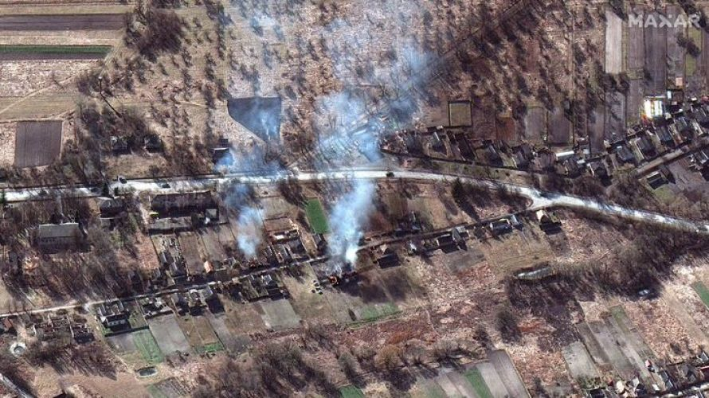
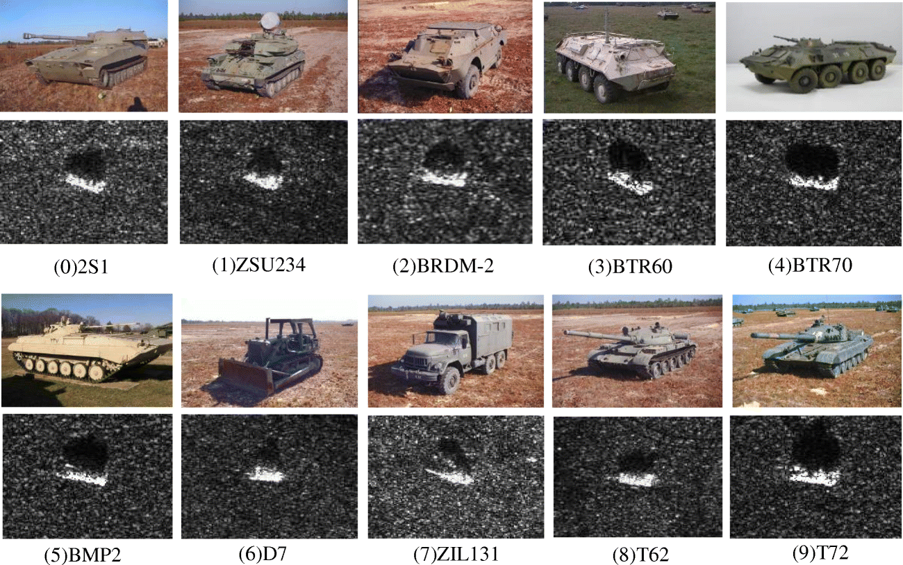

# Target Recognition in Sythentic Aperture Radar Imagery Using Deep Learning
### By: Nate DiRenzo

## Statement of Need:

As the general public strives to stay on top of modern conflicts such as the Russian invasion of Ukraine, the Syrian Civil War, or the Saudi Arabian intervention in Yemen, news publications and open-source intelligence analysts have increasingly turned to near real-time satellite imagery to identify areas of fighting and infrastructure damage, verify firsthand accounts of attacks, and monitor the deployment of sea, land, and air assets. 

Of particular interest for this task is synthetic aperture radar (SAR) imagery. SAR has the ability to penetrate atmospheric conditions, and provide visibility in cloud-covered areas both day and night.

Given the volume of high resolution satellite imagery coming from conflict zones on a 24/7 basis, news outlets, intelligence analysts, and most importantly the combatatents themselves seek methods that allow them to  analyze imagery, and quickly identify the presence of objects such as land, sea, and air assets.

In this project, we will work with the Moving and Stationary Target Acquisition and Recognition (MSTAR) Dataset produced by the United States Defense Adavanced Research Projects Agency (DARPA) and the United State Air Force Research Laboratory. We will attempt to correctly identify and classify targets within SAR imagery, and evaluate the efficacy of using such a model in a real-world enviornment using selected metrics.

## Goal:

The goal of this project is to create a deep learning model that accurately classifies objects detected in SAR imagery according to the target classes present in the MSTAR dataset. Previous work on this subject suggests accuracy of above 90% is attainable, so our goal will be to produce a model that meets that threshold.

## Success Metrics:

In practical terms, this model would be used in tandem with a human analyst. Because of that, we want a model that would return every potential target match found in satellite imagery, and allow the subject matter expert to sort though the results.

In technical terms, we are looking for model that exhibits high accuracy and high recall. Accuracy refers to how well the model identifies the various targets. Recall refers to the models ability to capture all relevant results.

## Data Description:

The MSTAR dataset was prdocued between 1995-1997 in a collaboration between DARPA/Air Force Research Laboratories. It contains roughly 1000 SAR images of 8 different vehicle types:
1. [2S1 Gvozdika](https://en.wikipedia.org/wiki/2S1_Gvozdika)
2. [BRDM-2](https://en.wikipedia.org/wiki/BRDM-2)
3. [BTR-60](https://en.wikipedia.org/wiki/BTR-60)
4. [D7](https://en.wikipedia.org/wiki/Caterpillar_D7)
5. [SLICY](https://www.sdms.afrl.af.mil/index.php?collection=mstar&page=targets)
6. [T62](https://en.wikipedia.org/wiki/T-62)
7. [ZIL-131](https://en.wikipedia.org/wiki/ZIL-131#:~:text=The%20ZIL%2D131%20is%20a,a%204%2Dwheeled%20powered%20trailer.)
8. [ZSU-23-4 Shilka](https://en.wikipedia.org/wiki/ZSU-23-4_Shilka)

## Tools:

- **Tensorflow/Keras**
- **Seaborn**
- **Pandas**
- **Numpy**

## Models:
- **Nueral Network**

## MVP Goal:

Produce a baseline neural network and evaluate the results using a confusion matrix. Use these results to inform subsequent direction of solution path and future iterations.
